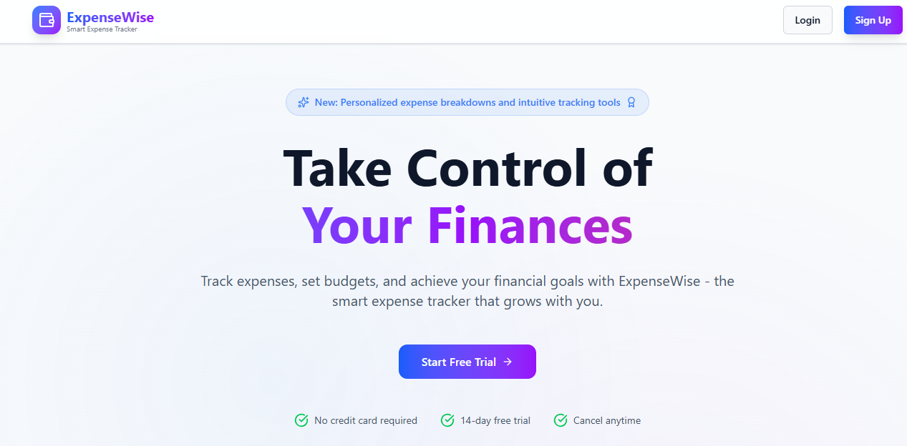
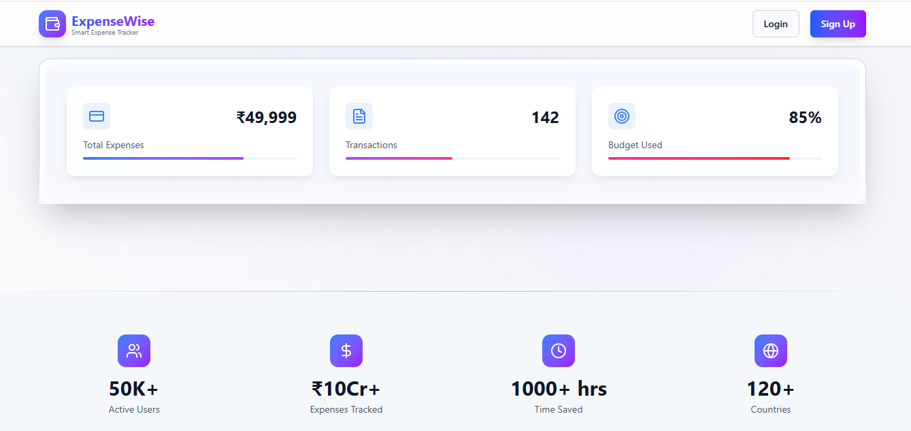
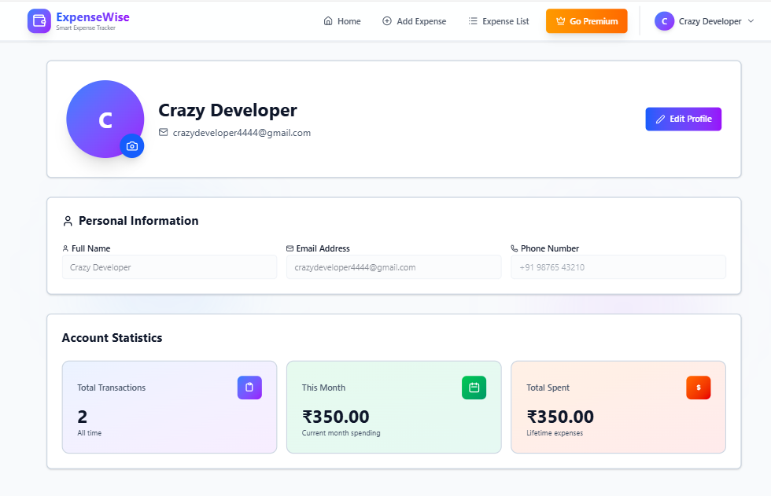
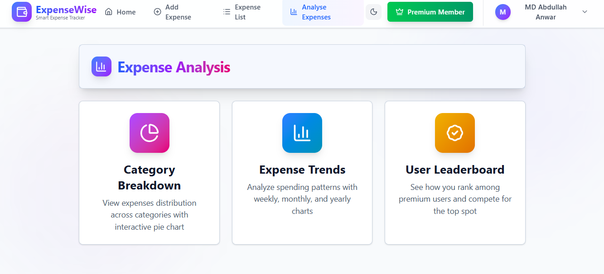
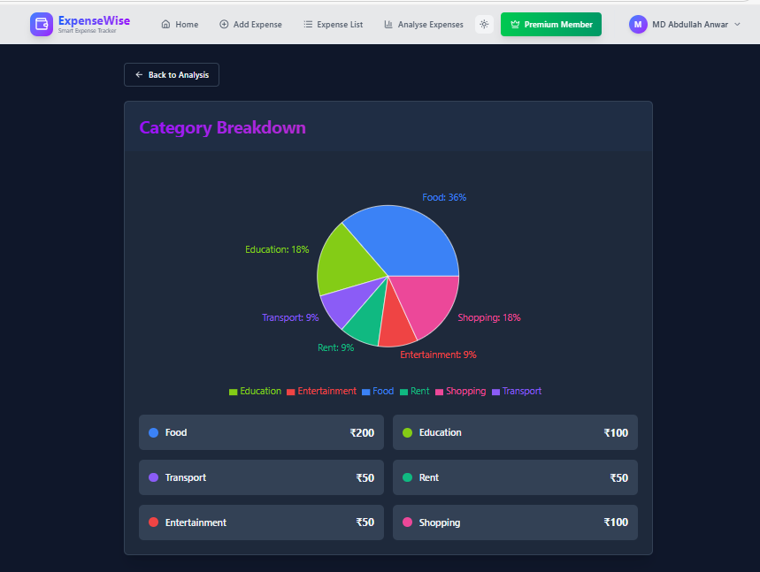
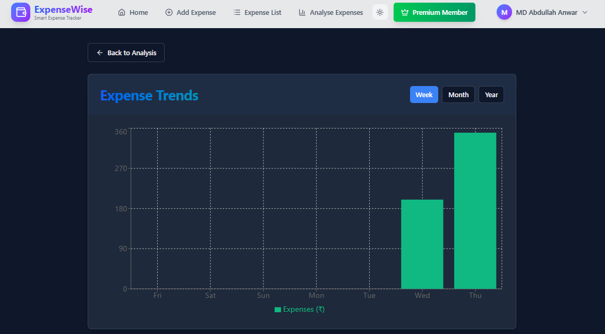
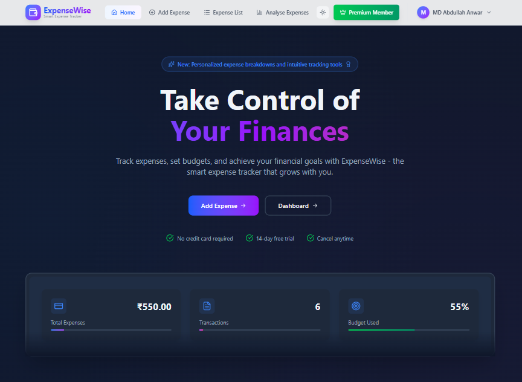

# 💰 ExpenseWise - Personal Expense Tracker

A full-stack expense tracking application built with React, Node.js, Express, and MySQL. Track your expenses, set budgets, analyze spending patterns, and manage your finances effectively.


## 📋 Table of Contents

- [Features](#-features)
- [Screenshots](#-screenshots)
- [Tech Stack](#-tech-stack)
- [Getting Started](#-getting-started)
- [Installation](#-installation)
- [Environment Variables](#-environment-variables)
- [Database Setup](#-database-setup)
- [Running the Application](#-running-the-application)
- [API Documentation](#-api-documentation)
- [Project Structure](#-project-structure)
- [Contributing](#-contributing)
- [License](#-license)

## ✨ Features

### Core Features
- 🔐 **User Authentication** - Secure signup/login with JWT tokens
- 💳 **Expense Management** - Add, edit, delete, and view expenses
- 📊 **Budget Tracking** - Set monthly budgets with visual progress indicators
- 🔍 **Search & Filter** - Find expenses by description, category, or amount
- 📱 **Responsive Design** - Works seamlessly on desktop, tablet, and mobile
- 🌓 **Dark/Light Theme** - Toggle between themes (Premium feature)

### Premium Features
- ⭐ **Premium Membership** - Razorpay payment integration
- 📈 **Advanced Analytics** - Detailed expense trends and insights
- 📊 **Category Breakdown** - Visual pie charts of spending by category
- 🏆 **Leaderboard** - Compare spending with other premium users
- 📥 **CSV Export** - Download expense data for external analysis

### Additional Features
- 👤 **Profile Management** - Update personal info and upload profile photo
- 🔄 **Real-time Updates** - Optimistic UI updates for instant feedback
- 📧 **Password Reset** - Email-based password recovery
- 💾 **Transaction Safety** - Database transactions ensure data consistency
- 🔔 **Toast Notifications** - User-friendly feedback messages

## 📸 Screenshots

### Landing Page - Hero Section

*Beautiful hero section with call-to-action and feature highlights*

### Landing Page - Features

*Comprehensive feature showcase with icons and descriptions*

### Landing Page - Pricing

*Transparent pricing plans with feature comparison*

### Add Expense

*Simple and intuitive expense entry form with budget indicator*

### Expense List

*View all expenses with search, filter, and pagination*

### Premium Features

*Premium membership page with Razorpay integration*

### Profile Page

*User profile with statistics and photo upload*

### Unlocked Premium Features

*Premium membership page unlocked with Transaction breakdown days, weekly and monthly spending with pagination and Expense Report PDF Export*

### Expense Analysis

*Comprehensive expense Category Breakdown, Expense Trends and Leaderboard comes in Premium membership*

### Category Breakdown

*Pie chart showing expense distribution by category*

### Expense Trends

*Visual analytics with charts and spending trends daily, weekly and monthly*

### User Leaderboard

*Top spenders list - See how you rank among all users and compete for the top spot*

### Dark Mode

*Beautiful dark theme for comfortable viewing*

## 🛠 Tech Stack

### Frontend
- **React 18** - UI library
- **Vite** - Build tool and dev server
- **Redux Toolkit** - State management
- **React Router v6** - Client-side routing
- **Axios** - HTTP client
- **Tailwind CSS** - Utility-first CSS framework
- **Lucide React** - Icon library

### Backend
- **Node.js** - Runtime environment
- **Express.js** - Web framework
- **MySQL** - Relational database
- **Sequelize** - ORM for MySQL
- **JWT** - Authentication tokens
- **Bcrypt** - Password hashing
- **Razorpay** - Payment gateway
- **Nodemailer** - Email service

## 🚀 Getting Started

### Prerequisites

- Node.js (v14 or higher)
- MySQL (v8 or higher)
- npm or yarn
- Razorpay account (for premium features)
- Brevo account (for email service)

## 📦 Installation

### 1. Clone the Repository

```bash
git clone https://github.com/yourusername/expense-tracker.git
cd expense-tracker
```

### 2. Install Backend Dependencies

```bash
cd Backend
npm install
```

### 3. Install Frontend Dependencies

```bash
cd ../Frontend
npm install
```

## 🔧 Environment Variables

### Backend (.env)

Create a `.env` file in the `Backend` directory:

```env
# Server Configuration
PORT=5000
NODE_ENV=development

# Database Configuration
DB_NAME=expense_tracker
DB_USER=root
DB_PASSWORD=your_password
DB_HOST=localhost

# JWT Secret
JWT_SECRET=your_super_secret_jwt_key_here

# Razorpay Configuration
RAZORPAY_KEY_ID=your_razorpay_key_id
RAZORPAY_KEY_SECRET=your_razorpay_secret

# Email Configuration (Brevo)
BREVO_API_KEY=your_brevo_api_key
BREVO_SENDER_EMAIL=your_email@example.com
BREVO_SENDER_NAME=ExpenseWise
```

### Frontend (.env)

Create a `.env` file in the `Frontend` directory:

```env
VITE_API_URL=http://localhost:5000
```

## 🗄 Database Setup

### 1. Create Database

```sql
CREATE DATABASE expense_tracker;
```

### 2. Run Migrations

```bash
cd Backend
npx sequelize-cli db:migrate
```

This will create the following tables:
- Users
- Expenses
- Orders
- ForgotPasswordRequests

## ▶️ Running the Application

### Start Backend Server

```bash
cd Backend
npm run dev
```

Backend runs on `http://localhost:5000`

### Start Frontend Development Server

```bash
cd Frontend
npm run dev
```

Frontend runs on `http://localhost:5173`

### Access the Application

Open your browser and navigate to `http://localhost:5173`

## 📚 API Documentation

### Authentication Endpoints

#### POST /user/signup
Register a new user
```json
{
  "name": "John Doe",
  "email": "john@example.com",
  "password": "password123"
}
```

#### POST /user/login
Login user
```json
{
  "email": "john@example.com",
  "password": "password123"
}
```

### Expense Endpoints

#### GET /expense
Get all expenses (requires authentication)

#### POST /expense/add
Add new expense
```json
{
  "amount": 500,
  "description": "Groceries",
  "category": "Food",
  "note": "Weekly shopping"
}
```

#### PUT /expense/:id
Update expense

#### DELETE /expense/:id
Delete expense

### Premium Endpoints

#### POST /payment/create-order
Create Razorpay order

#### POST /payment/verify
Verify payment and activate premium

### Profile Endpoints

#### PUT /user/profile
Update user profile
```json
{
  "name": "John Doe",
  "email": "john@example.com",
  "phone": "+91 9876543210",
  "profilePhoto": "base64_encoded_image"
}
```

#### PUT /user/budget
Update monthly budget
```json
{
  "monthlyBudget": 50000
}
```

For complete API documentation, see [Backend/docs/API_DOCUMENTATION.md](Backend/docs/API_DOCUMENTATION.md)

## 📁 Project Structure

```
expense-tracker/
├── Backend/
│   ├── config/              # Database and app configuration
│   ├── controllers/         # Request handlers
│   ├── services/           # Business logic
│   ├── models/             # Sequelize models
│   ├── routes/             # API routes
│   ├── middlewares/        # Auth and validation
│   ├── migrations/         # Database migrations
│   ├── scripts/            # Utility scripts
│   ├── docs/               # Backend documentation
│   ├── .env                # Environment variables
│   ├── server.js           # Entry point
│   └── package.json
│
├── Frontend/
│   ├── src/
│   │   ├── components/     # React components
│   │   │   ├── analyse/   # Analytics components
│   │   │   ├── expense/   # Expense management
│   │   │   ├── forms/     # Auth forms
│   │   │   ├── landing/   # Landing page
│   │   │   ├── layout/    # Layout components
│   │   │   ├── premium/   # Premium features
│   │   │   ├── profile/   # User profile
│   │   │   └── ui/        # Reusable UI components
│   │   ├── store/         # Redux store
│   │   ├── hooks/         # Custom hooks
│   │   ├── lib/           # Utilities
│   │   ├── context/       # React contexts
│   │   ├── App.jsx        # Main app component
│   │   └── main.jsx       # Entry point
│   ├── docs/              # Frontend documentation
│   ├── .env               # Environment variables
│   ├── vite.config.js     # Vite configuration
│   └── package.json
│
├── screenshots/           # Application screenshots
├── README.md             # This file
└── LICENSE               # MIT License
```

## 🎯 Key Features Explained

### Budget Tracking
Set a monthly budget and track your spending in real-time. Visual indicators show:
- Green: Under 60% of budget
- Yellow: 60-80% of budget
- Orange: 80-100% of budget
- Red: Over budget

### Transaction Safety
All database operations use transactions to ensure:
- Atomicity: Operations complete fully or not at all
- Consistency: Data remains valid
- Isolation: Concurrent operations don't interfere
- Durability: Committed changes persist

### Optimistic Updates
The UI updates immediately when you:
- Add an expense
- Edit an expense
- Delete an expense

If the operation fails, changes are automatically reverted.

### Premium Membership
Unlock advanced features with a one-time payment of ₹499:
- Advanced analytics and trends
- Category breakdown charts
- Leaderboard access
- CSV export functionality
- Dark/Light theme toggle

## 🔒 Security Features

- JWT-based authentication with 1-hour token expiry
- Bcrypt password hashing with salt rounds
- SQL injection prevention via Sequelize ORM
- XSS protection with React's built-in escaping
- CORS configuration for API security
- Environment variables for sensitive data
- Auto-logout on token expiration

## 🧪 Testing

### Backend Tests
```bash
cd Backend
npm test
```

### Frontend Tests
```bash
cd Frontend
npm test
```

## 📈 Performance

- Lazy loading for route-based code splitting
- Optimized bundle size with Vite
- Database connection pooling
- Efficient state management with Redux
- Pagination for large datasets
- Image optimization for profile photos

## 🤝 Contributing

Contributions are welcome! Please follow these steps:

1. Fork the repository
2. Create a feature branch (`git checkout -b feature/AmazingFeature`)
3. Commit your changes (`git commit -m 'Add some AmazingFeature'`)
4. Push to the branch (`git push origin feature/AmazingFeature`)
5. Open a Pull Request

## 📝 License

This project is licensed under the MIT License - see the [LICENSE](LICENSE) file for details.

## 👨‍💻 Author

**Your Name**
- GitHub: [@MdAbdullahAnwar](https://github.com/MdAbdullahAnwar)
- Email: crazydeveloper4444@gmail.com

## 🙏 Acknowledgments

- React team for the amazing library
- Express.js for the robust backend framework
- Tailwind CSS for the utility-first CSS framework
- Razorpay for payment integration
- All open-source contributors

## 📞 Support

For support, email crazydeveloper4444@gmail.com or open an issue on GitHub.

## 🗺 Roadmap

- [ ] Mobile app (React Native)
- [ ] Recurring expenses
- [ ] Multi-currency support
- [ ] Expense categories customization
- [ ] Budget alerts via email/SMS
- [ ] Export to PDF
- [ ] Expense sharing with family
- [ ] AI-powered spending insights
- [ ] Bank account integration
- [ ] Receipt scanning with OCR

---

Made with ❤️ by [MD Abdullah Anwar](https://github.com/MdAbdullahAnwar)
